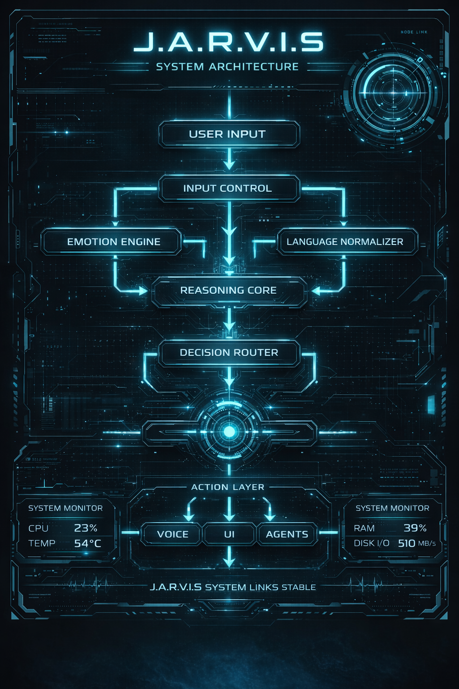

# 🤖 J.A.R.V.I.S

<p align="center">

<a href="https://www.python.org/downloads/">
  
</a>

<a href="https://learn.microsoft.com/en-us/windows/">
  
</a>

<a href="https://github.com/0xjarvisironman/J.A.R.V.I.S">
  
</a>

<a href="https://doc.qt.io/qtforpython/">
  
</a>

<a href="https://elevenlabs.io/">
  
</a>

<a href="https://en.wikipedia.org/wiki/Optical_character_recognition">
  
</a>

<a href="LICENSE">
  
</a>

<a href="https://github.com/0xjarvisironman/J.A.R.V.I.S">
  
</a>

</p>

<p align="center">

<a href="https://github.com/0xjarvisironman/J.A.R.V.I.S">
  
</a>

<a href="https://github.com/0xjarvisironman/J.A.R.V.I.S/stargazers">
  
</a>

<a href="https://github.com/0xjarvisironman/J.A.R.V.I.S/network/members">
  
</a>

</p>

<p align="center">

<a href="https://github.com/0xjarvisironman/J.A.R.V.I.S">
  
</a>

<a href="https://github.com/0xjarvisironman/J.A.R.V.I.S">
  
</a>

<a href="https://github.com/0xjarvisironman/J.A.R.V.I.S">
  
</a>

</p>

### *Just A Rather Very Intelligent System*

> **A native desktop AI assistant inspired by Iron-Man’s JARVIS**
> Voice-controlled • Vision-enabled • System-level automation • Animated HUD UI

---

## 🚀 What is J.A.R.V.I.S?

**J.A.R.V.I.S** is a **fully native desktop AI assistant** built in Python.
It does **not run in a browser**, does **not rely on localhost**, and interacts **directly with your operating system**.

Think of it as:

* 🧠 Your personal system intelligence
* 🎤 A real voice-driven assistant
* 👁️ With screen vision & control
* 🌀 Wrapped in an Iron-Man style animated interface

---

## ✨ Key Features

### 🎤 Voice Control

* Real-time microphone listening
* Natural language understanding
* Interrupt commands (`Jarvis stop`, `wait`, etc.)

### 🔊 Neural Voice Output

* ElevenLabs high-quality voice
* Emotion-aware responses (calm, serious, warning)
* Direct RAM audio streaming (no temp files)

### 👁️ Vision System

* Screen OCR (read what’s on screen)
* Click buttons or UI elements by name
* Vision + command combined actions

### 🖥️ System Automation

* Open apps (Notepad, VS Code, Calculator, Browser)
* Type content automatically
* Perform calculations
* Fetch system stats (CPU / RAM)

### 🌀 Iron-Man Style UI

* Native desktop app (PyQt / PySide6)
* Animated Jarvis Ring
* Ring reacts to:

  * Listening
  * Speaking
  * Idle state
* No “standby mode” — always active

---

## 🧱 Architecture Overview

<p align="center">
  
</p>

<p align="center">
  <i>Iron-Man inspired system flow — J.A.R.V.I.S cognitive and execution pipeline</i>
</p>

---

## 🧩 Technology Stack

* **Python 3.10**
* **PySide6 / PyQt (Qt Framework)**
* **SpeechRecognition**
* **ElevenLabs TTS**
* **OpenCV + Tesseract (Vision)**
* **PyAutoGUI (System Control)**

---

## ⚙️ Installation

### 1️⃣ Clone Repository

```bash
git clone https://github.com/0xjarvisironman/J.A.R.V.I.S.git
cd J.A.R.V.I.S
```

### 2️⃣ Create Virtual Environment

```bash
python -m venv vision_env
vision_env\Scripts\activate
```

### 3️⃣ Install Dependencies

```bash
pip install -r requirements.txt
```

### 4️⃣ Setup Environment Variables

Create a `.env` file (DO NOT commit this):

```env
ELEVENLABS_API_KEY=your_api_key_here
ELEVENLABS_VOICE_ID=your_voice_id_here
TTS_PROVIDER=elevenlabs
```

### 5️⃣ Run JARVIS

```bash
python main.py
```

---

## ⚠️ Important Notes

* This is **NOT a web app**
* This is **NOT Electron**
* This is **NOT browser-based**
* Runs as a **true desktop application**
* Appears in taskbar like real software

---

## 🛡️ Security & Privacy

* No background server
* No hidden telemetry
* Internet used only when required
* Local system actions only on user command

---

## 🔮 Upcoming Updates (Roadmap)

Goal: Functional Jarvis core
Voice input (SpeechRecognition)
Neural voice output (ElevenLabs)
Vision (OCR + click automation)
System control (Notepad, Calculator, Browser, VS Code)
PyQt native UI (Jarvis Ring)
Emotion-aware responses
Status: ✅ Live / Working

### 🔹 PHASE 1 — PUBLIC ALPHA - Completed and Live
Goal: Stability + community usability
Jarvis Ring animation sync (Listening / Speaking / Idle)
Config file support (jarvis.config.json)
Safe command sandbox
Plugin-ready architecture
Improved error handling
Outcome:
Open-source users can run Jarvis reliably on their system.

### 🔹 PHASE 2 — INTELLIGENCE UPGRADE - Upcoming
Goal: Jarvis becomes a true assistant
Context memory (short + long)
Multi-step command reasoning
Self-correction & retries
Screen understanding (summaries, error detection)
App-aware actions

### 🔹 PHASE 3 — ECOSYSTEM - Upcoming
Goal: Jarvis as a platform
Plugin marketplace
Voice packs
UI themes
Skill packs (Developer, Trader, Creator, Analyst modes)

### 🔹 PHASE 4 — DISTRIBUTION - Upcoming
Goal: Mass adoption
Windows EXE build
Auto updater
Optional cloud sync
Companion dashboard (future)

###🔹 PHASE 5 — AUTONOMOUS JARVIS (VISION) - Upcoming
Goal: Iron-Man level assistant
Predictive actions
Scheduled autonomy
Behavioral learning
Minimal confirmations
---

## 📜 License

**Apache License 2.0**

✔ Commercial use allowed
✔ Modification allowed
✔ Distribution allowed
✔ Attribution protected

---

## 🤝 Contributing

Pull requests are welcome.
This project is built to grow as a community-driven intelligence system.

---

## ⚡ Final Words

> J.A.R.V.I.S is not a demo.
> It is the foundation of a real system intelligence.
